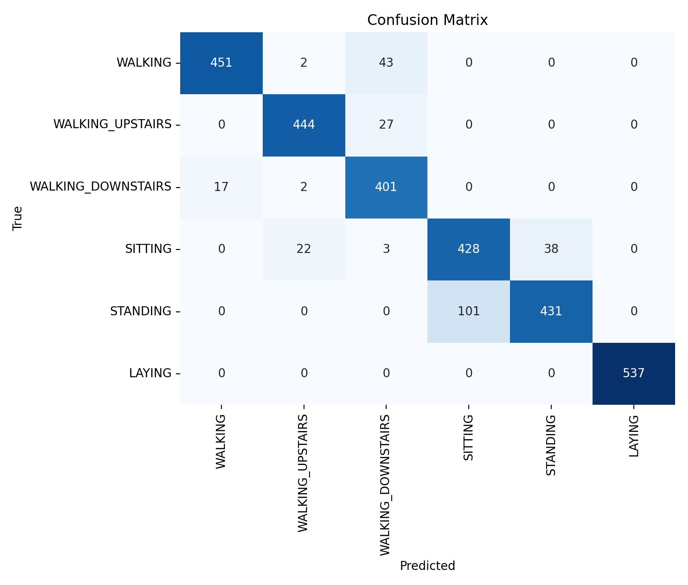
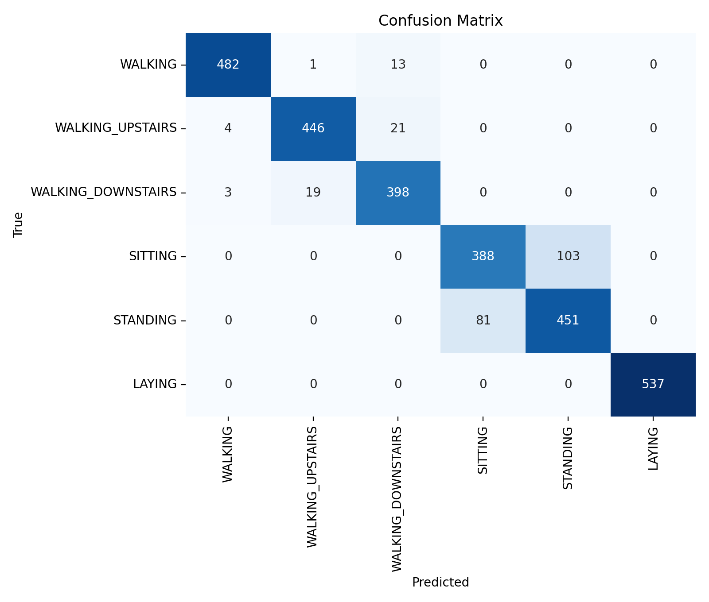

# Milestone 2 Report Draft

Project: Energy-Efficient Human Activity Recognition on the Edge

Team: Lee Ting Sen (B00103724), Khalifa Alshamsi (B00078654), Vineetha Addanki (G00111196).

Track: B, open/public dataset. Primary benchmark: UCI HAR. Secondary validation dataset: Fordham WISDM Activity Prediction v1.1.

## R1 Dataset Description

The core task is six-class human activity recognition from wearable inertial signals:

| Class | Definition |
|---|---|
| WALKING | Subject walks on level ground while wearing the source phone at the waist. |
| WALKING_UPSTAIRS | Subject walks upstairs while wearing the source phone at the waist. |
| WALKING_DOWNSTAIRS | Subject walks downstairs while wearing the source phone at the waist. |
| SITTING | Subject is seated during the labelled window. |
| STANDING | Subject is standing during the labelled window. |
| LAYING | Subject is lying down during the labelled window. |

UCI HAR v1.0 is the main benchmark. It contains 10,299 prewindowed samples from 30 subjects aged 19 to 48, captured with a Samsung Galaxy S II worn at the waist. The release includes total acceleration, body acceleration, and gyroscope inertial windows at 50 Hz, with 2.56 s windows and 50% overlap. This implementation uses total acceleration x/y/z plus gyroscope x/y/z so gravity/posture cues remain available for SITTING, STANDING, and LAYING, and because that signal view is closer to Arduino IMU collection.

UCI HAR source and license note: UCI Machine Learning Repository, "Human Activity Recognition Using Smartphones," `https://archive.ics.uci.edu/dataset/240/human+activity+recognition+using+smartphones`. The dataset README requires citation of Anguita et al., "Human Activity Recognition on Smartphones using a Multiclass Hardware-Friendly Support Vector Machine," and states that commercial use is prohibited. The dataset is distributed as-is with no responsibility implied by the authors or institutions.

WISDM Activity Prediction v1.1 is secondary validation and domain-gap support. The downloaded Fordham WISDM classic raw file contains 1,098,207 parsed accelerometer rows from 36 subjects and six labels: Walking, Jogging, Upstairs, Downstairs, Sitting, Standing. It is accelerometer-only and does not include LAYING. Source: `https://www.cis.fordham.edu/wisdm/dataset.php`. The WISDM README requests citation of Kwapisz, Weiss, and Moore, "Activity Recognition using Cell Phone Accelerometers," and inclusion of `readme.txt` when sharing or redistributing; no explicit OSI or Creative Commons license text was found in the downloaded files.

UCI HAR split used in this package:

| Class | Train | Val | Test | Total |
|---|---:|---:|---:|---:|
| WALKING | 888 | 338 | 496 | 1722 |
| WALKING_UPSTAIRS | 797 | 276 | 471 | 1544 |
| WALKING_DOWNSTAIRS | 744 | 242 | 420 | 1406 |
| SITTING | 993 | 293 | 491 | 1777 |
| STANDING | 1053 | 321 | 532 | 1906 |
| LAYING | 1076 | 331 | 537 | 1944 |

The test set is the official UCI subject-disjoint test split with 2,947 windows from 9 subjects. The validation set is a deterministic subject-held-out split from the official training subjects.

WISDM raw row counts are Walking 424,398, Jogging 342,179, Upstairs 122,869, Downstairs 100,427, Sitting 59,939, and Standing 48,395. These are not split into the six-class UCI train/validation/test benchmark because WISDM is secondary validation data with a different label taxonomy and sensor set.

## R2 Data Card

| Field | Value |
|---|---|
| Task type | Multi-class activity classification |
| Number of classes | 6 for UCI HAR core study |
| Sensors | UCI HAR: 3-axis total accelerometer and 3-axis gyroscope; WISDM classic: 3-axis accelerometer only |
| Sampling rate | UCI HAR: 50 Hz; WISDM classic: nominal 20 Hz |
| Window length and overlap | UCI HAR: 2.56 s, 50% overlap, 128 readings/window |
| Features/input | Raw prewindowed inertial sequences `[128, 6]` for UCI HAR model inputs |
| Total UCI samples | 10,299 windows |
| Train/val/test ratio | 5,551 / 1,801 / 2,947 windows |
| Split method | Official UCI subject-disjoint test split; validation held out by subject from training set |
| Number of subjects | UCI HAR: 30 total; WISDM classic: 36 |
| Environments | UCI HAR lab/protocol conditions from public release; WISDM original collection conditions not fully controlled in this repo |
| Dataset URLs | UCI HAR: `https://archive.ics.uci.edu/dataset/240/human+activity+recognition+using+smartphones`; WISDM: `https://www.cis.fordham.edu/wisdm/dataset.php` |
| License/terms | UCI HAR README permits non-commercial use with citation; WISDM downloaded files request citation/readme inclusion and do not include explicit OSI/CC license text |
| Original recording equipment | UCI HAR: Samsung Galaxy S II waist smartphone; WISDM classic: smartphone accelerometer data from Fordham WISDM release |
| Known limitations | UCI HAR is smartphone-waist data and already preprocessed; WISDM lacks LAYING and is accelerometer-only |
| Domain gap vs Arduino | Different IMU, placement, sampling clock, preprocessing, noise, and body/device attachment |
| Arduino M3 plan | Collect Nano 33 BLE Sense accelerometer + gyroscope data at 50 Hz, 2.56 s windows, 50% overlap, 3 to 5 users, 2 environments, target at least 50 labelled windows per class |

WISDM timestamp audit found irregular effective sampling despite the nominal 20 Hz rate. Median effective rate was about 20.00 Hz, but rounded dt modes included 50 ms, 40 ms, 80 ms, 100 ms, and 60 ms; 145,865 dt values exceeded the median plus 5 IQR threshold. WISDM is therefore not treated as directly interchangeable with UCI HAR.

## R3 Preprocessing Pipeline

For UCI HAR, the code loads the standard inertial signal rows: total acceleration x/y/z and body gyroscope x/y/z. These are already windowed into 128-sample windows by the official release. The package does not relabel or merge classes. Normalization is fit on the training split only, then applied to validation and test. The current TensorFlow runs use per-channel train-only standardization. This change fixes the earlier static-posture failure caused by using body acceleration without gravity cues.

For WISDM classic, the code parses semicolon-delimited raw rows, extracts subject, activity, timestamp, and x/y/z acceleration, converts the raw acceleration scale using the WISDM about-file statement that 10 equals 1g, audits timestamp dt distributions, and can regularize each subject/activity stream to 20 Hz before fixed-window segmentation. WISDM class taxonomy is preserved; Jogging is not forced into UCI HAR and LAYING is not invented.

## R4 Baseline Models

Baseline A, Paper Reproduction Baseline: offline reference only, not intended for direct Arduino deployment. It implements five TensorFlow/Keras level-0 hybrid learners: ConvLSTM, CNN-GRU, CNN-BiGRU, CNN-BiLSTM, and CNN-LSTM. The stacked level-1 learner is XGBoost. Input shape is `[128, 6]`; output is six activity classes. Training uses sparse categorical cross-entropy, Adam, learning rate 0.001, inverse-time decay 0.01, batch size 50, early stopping on validation loss, and an XGBoost grid search with 5-fold CV.

Baseline B, Lightweight TinyML-Oriented Baseline: a compact TensorFlow/Keras 1D depthwise-separable CNN with 1,922 total Keras parameters. Input shape is `[128, 6]`; output is six softmax probabilities. It uses sparse categorical cross-entropy, Adam, learning rate 0.001, inverse-time decay 0.01, batch size 50, and early stopping. The saved TFLite model is 13,460 bytes, making this the practical M3 path.

## R5 Held-Out Test Results

The held-out test set is the official UCI HAR test split with 2,947 windows.

| Baseline | Run setting | Accuracy | Macro F1 | Weighted F1 |
|---|---|---:|---:|---:|
| Paper Reproduction Baseline | 20-epoch bounded TensorFlow run, fast XGBoost grid | 0.9135 | 0.9128 | 0.9137 |
| Lightweight TinyML-Oriented Baseline | 40 epochs, patience 8 | 0.9169 | 0.9173 | 0.9168 |

Paper reproduction per-class metrics:

| Class | Precision | Recall | F1 | Support |
|---|---:|---:|---:|---:|
| WALKING | 0.9637 | 0.9093 | 0.9357 | 496 |
| WALKING_UPSTAIRS | 0.9447 | 0.9427 | 0.9437 | 471 |
| WALKING_DOWNSTAIRS | 0.8460 | 0.9548 | 0.8971 | 420 |
| SITTING | 0.8091 | 0.8717 | 0.8392 | 491 |
| STANDING | 0.9190 | 0.8102 | 0.8611 | 532 |
| LAYING | 1.0000 | 1.0000 | 1.0000 | 537 |

Lightweight per-class metrics:

| Class | Precision | Recall | F1 | Support |
|---|---:|---:|---:|---:|
| WALKING | 0.9857 | 0.9718 | 0.9787 | 496 |
| WALKING_UPSTAIRS | 0.9571 | 0.9469 | 0.9520 | 471 |
| WALKING_DOWNSTAIRS | 0.9213 | 0.9476 | 0.9343 | 420 |
| SITTING | 0.8273 | 0.7902 | 0.8083 | 491 |
| STANDING | 0.8141 | 0.8477 | 0.8306 | 532 |
| LAYING | 1.0000 | 1.0000 | 1.0000 | 537 |

The saved confusion matrices and per-class CSV files are under `outputs/lightweight/metrics/` and `outputs/reproduction/metrics/`. Figures are under `outputs/lightweight/figures/` and `outputs/reproduction/figures/`.

TinyML efficiency status: the lightweight Keras model has 1,922 parameters and the generated TensorFlow Lite flatbuffer is 13,460 bytes. The current host CPU Keras latency proxy is 62.65 ms mean over 20 runs, which is useful only for regression tracking before Arduino timing; it is not an on-device latency claim.

## R6 Error Analysis

Top lightweight confusion pairs after the static-posture fix were SITTING to STANDING (103), STANDING to SITTING (81), WALKING_UPSTAIRS to WALKING_DOWNSTAIRS (21), WALKING_DOWNSTAIRS to WALKING_UPSTAIRS (19), and WALKING to WALKING_DOWNSTAIRS (13). LAYING is now perfectly classified in this run. The remaining static error is specifically SITTING/STANDING, which is plausible because both have low motion and can share similar waist-phone orientation depending on subject posture.

Top paper-reproduction confusion pairs after the TensorFlow refactor were STANDING to SITTING (101), WALKING to WALKING_DOWNSTAIRS (43), SITTING to STANDING (38), WALKING_UPSTAIRS to WALKING_DOWNSTAIRS (27), and SITTING to WALKING_UPSTAIRS (22). This is a major improvement over the earlier body-acceleration-only view; however, the run is still bounded to 20 epochs and uses a fast XGBoost grid, so it should not be claimed as the final paper-match run.

For M3, the main error-reduction work should focus on static posture separation, accelerometer-only ablations, and Arduino domain validation. WISDM also shows timestamp irregularity and lacks LAYING, so it should be used for secondary accelerometer robustness only, not as a direct six-class UCI replacement.

## R7 Updated Plan for M3

The paper reproduction baseline remains the offline reference. The deployable path will use the lightweight depthwise-separable 1D CNN, then quantize it and port it toward TensorFlow Lite Micro or an equivalent C/C++ inference path for Arduino Nano 33 BLE Sense. This preserves the revised Milestone 1 scope: UCI HAR is the primary benchmark, WISDM is secondary validation/domain-gap evidence, and the deployable model path prioritizes TensorFlow Lite/TFLM over non-deployable stacking models.

Concrete Arduino data collection plan: from April 18 to April 24, 2026, collect accelerometer and gyroscope streams from Arduino Nano 33 BLE Sense at 50 Hz using the same six UCI classes. Use 2.56 s windows with 50% overlap. Collect from 3 to 5 users in at least 2 environments, targeting at least 50 labelled windows per class after segmentation. Place the board consistently at the waist or in a fixed pouch/pocket. If the Arduino data shows a large domain gap, fall back to accelerometer-only magnitude and per-channel calibration experiments before retraining a final quantized model.

Robustness tests for M3: compare full accelerometer+gyroscope input against accelerometer-only input, measure latency on-device, record model size and RAM usage, and evaluate Arduino-collected holdout data separately from public UCI/WISDM data.

## Deliverables

- D2 dataset v1/scripts: `src/data/uci_har.py`, `src/data/wisdm.py`, `src/data/inspect_datasets.py`, `data/raw/` layout, and generated inspection JSON under `outputs/datacards/`.
- D3 runnable training code: `src/training/train_lightweight.py` and `src/training/train_reproduction.py`.
- D4 README update: repository README describes setup, data download, runs, and artifact locations.
